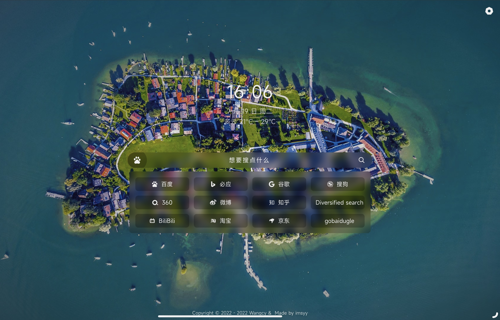

<strong><h2>起始页</h2></strong>
简约的起始页

### 介绍

</img>

>尚未完成

### Demo
>由于 CDN 缓存原因，查看最新效果可能需要 `Ctrl` + `F5` 强制刷新浏览器缓存

- [访问链接](https://wangcy.tk/startpage)

### 功能

- [x] 载入动画
- [x] 搜索引擎切换
- [x] 时间及天气显示
- [x] 快捷方式自定义
- [x] 网站背景自定义
- [x] 数据备份及恢复
- [x] 移动端适配
* [ ] 还没想好呢

### 插件

* [iziToast](https://izitoast.marcelodolza.com/)
* [Iconfont](https://www.iconfont.cn/)
* [jQuery](https://jquery.com/)

### API

* [小歪 API](https://api.ixiaowai.cn/)
* [天气 API](https://www.tianqiapi.com/)

### 鸣谢

本站部分内容参考自

* [青柠起始页](https://limestart.cn/)
* [sou2](https://github.com/yeetime/sou2/)

&nbsp;&nbsp;

### 修改

* 修改“常用”在js/set
* 修改其他在./index.html
